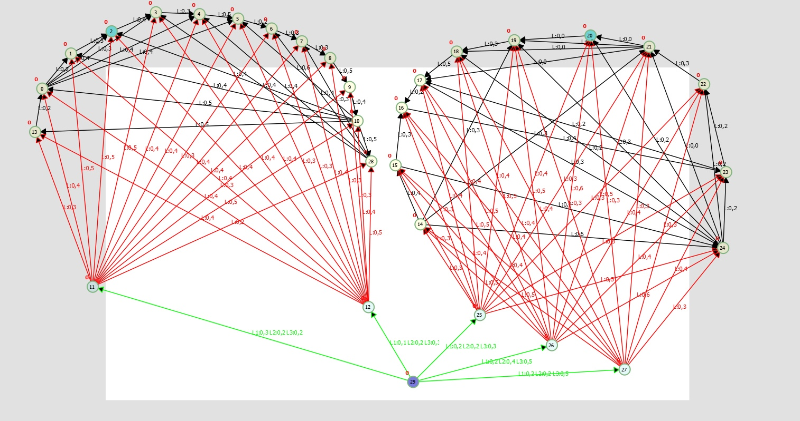
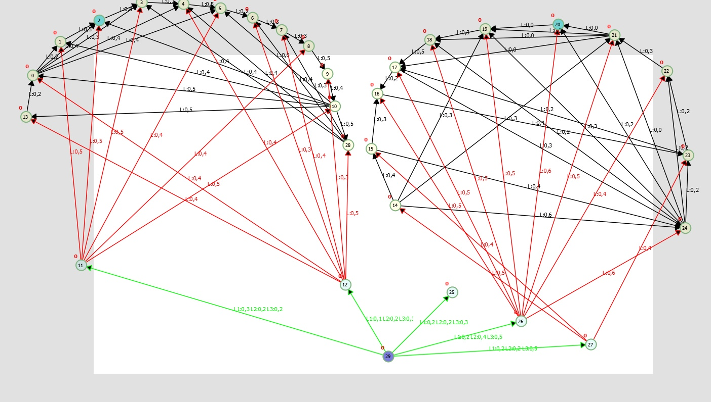
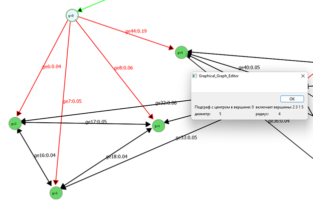
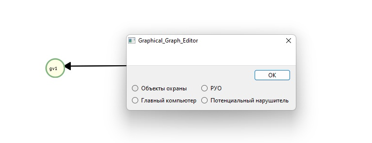
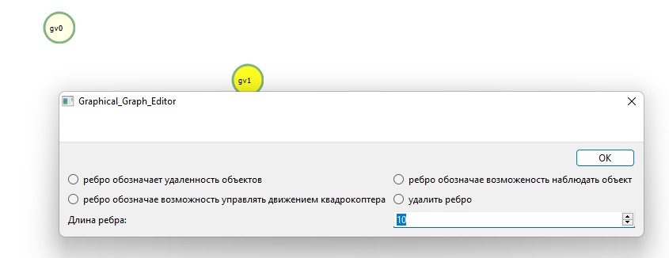

# QtGraphEditor
Это рассчетная система для построения графов с разнотипными видами вершин и связей, возможностью разбиения графов 
на подграфы методом пропорционального разделения, рассчетом матриц путей алгоритмом дейкстры для подграфов, 
сбором характеристик подграфа.

## Представление графовой модели в ПО
Графовая модель представлена не матрицами смежностями или инцендентности, а в качестве двунаправленного списка объектов
вершин, где каждая вершина содержит список объектов входящих и сиходящих связей. Это позволило более гибко обрабатывать те места алгоритма, 
где в рассчетах важны типы обеих вершин и самой связи.

## Примеры графов
Неразбитый полносвязный граф

Разбитый граф готовый для рассчета характеристик подграфов

Разделение на подграфы

Типы вершин

Типы Связей

